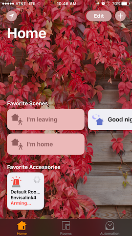

# EnvisaLink Alarm Server

This is a libary to communicate with commercial alarm panels using the [EnvisaLink](http://www.eyezon.com) TPI interface. It currently only works with DSC alarm panels, but could be extended to support Honeywell panels as well.

This is currently alpha-grade software. It has only been tested with an EnvisaLink4 module. 

Documentation for the Envisalink TPI interface can be found [here](http://forum.eyez-on.com/FORUM/viewtopic.php?f=6&t=301).

## MQTT and Apple HomeKit integration

The library was designed with the single goal of integrating a DSC panel with Apple's HomeKit using an EnvisaLink4 module. There are more capabilities of the TPI interface that were not necessary for that goal, and have been left uncompleted so far.



The repository includes two utilities that employ the library, `mqttetpi` and `hkmqtt`. Instructions for one way to set up a Raspberry Pi with these utilities can be found here: [Deployment to a Raspberry Pi](cmd/README.md)

### [cmd/mqttetpi](cmd/mqttetpi)

This utility is is a bridge between an MQTT broker and the Envisalink module, so that it can be integrated with any other system that uses MQTT. Partition state events (e.g., READY, EXIT_DELAY, ARMED) are exported on a topic. The partition can also be armed and disarmed.

```
States (read-only):
etpi/partition/[number]/state

Commands (write-only):
etpi/partition/1/command/arm_stay
etpi/partition/1/command/arm_away
etpi/partition/1/command/arm_disarm
```

It has only one dependency on [the MQTT library by Paho](https://github.com/eclipse/paho.mqtt.golang).

Here is an example using the `mosquitto` utility to arm the partition (an MQTT broker is running on a local Raspberry Pi):
```
$ mosquitto_pub -h pi.local:1883 -t "etpi/partition/1/command/arm_stay" -n
```

### [cmd/hkmqtt](cmd/hkmqtt)

`hkmqtt` utility is a bridge between the MQTT broker and Apple HomeKit to implement a SecuritySystem service for the Envisalink module.

It has dependencies on [the HomeControl library for HomeKit by brutella](https://github.com/brutella/hc) and [the MQTT library by Paho](https://github.com/eclipse/paho.mqtt.golang).

Once running, `hkmqtt` advertises a new accessory named "Envisalink4". It is paired with a manual code "32191123".

## Usage

```go
import "github.com/lazyeights/etpi"

etpiAddr := "192.168.1.24:4025"
pwd := "user"
code := "12345"

panel := etpi.NewPanel()
panel.OnZoneEvent(handleZone)
panel.OnPartitionEvent(handlePartition)
panel.OnKeypadEvent(handleKeypad)

// Connect to Envisalink. Connect will login to the Envisalink module, set the current date and time, and poll for the panel's current status.
if err := panel.Connect(etpiAddr, pwd, code); err != nil {
    panic("could not connect to Envisalink")
}
defer panel.Disconnect()

// Print the initial panel status
status := panel.Status()
fmt.Printf("%+v\n", status)
```

The library emits events for partitions, zones, and the keyboard that are handled by callback functions:

```go
func handlePartition(partition int, status etpi.PartitionStatus) {
	fmt.Println("partition=%d, status=%+v", partition, status)
    if status := etpi.PartitionStatusAlarm {
        fmt.Println("ALARM TRIGGERED!")
    }
}
```